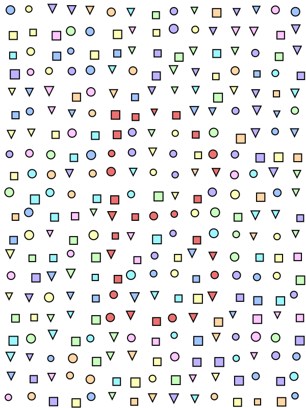
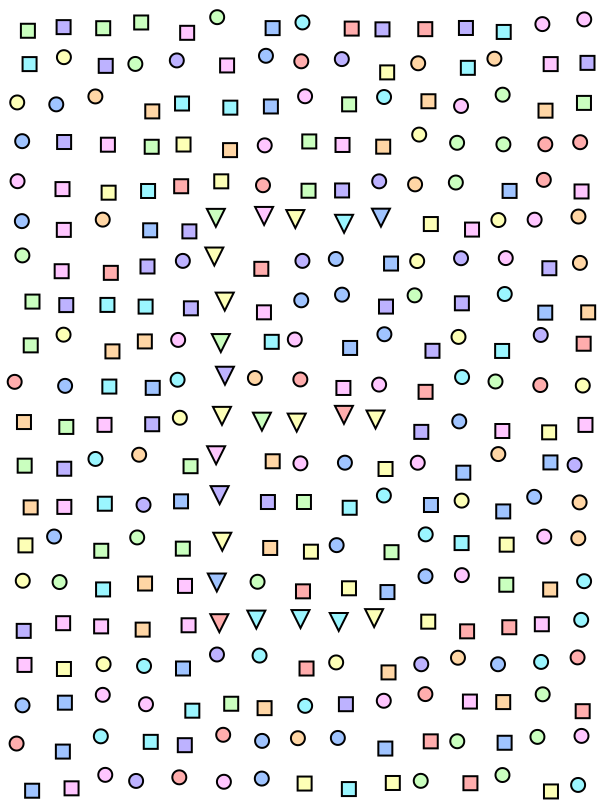
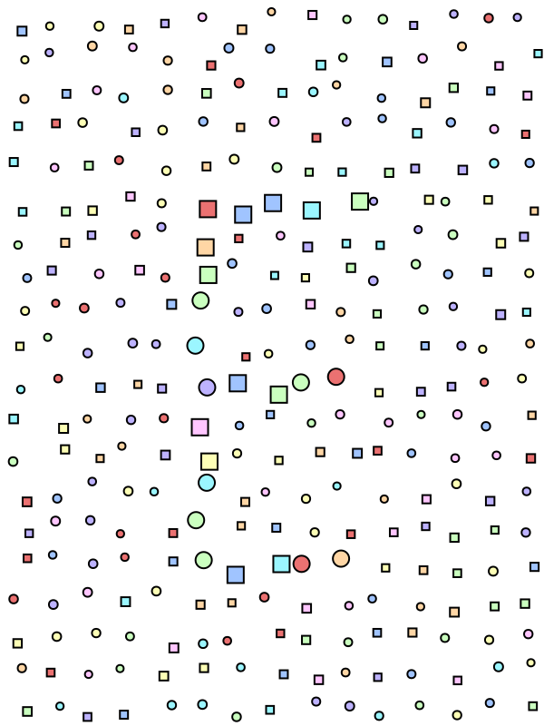

# puzzle design tools

Small utilities for generating puzzle content.

## Prerequisites

These scripts assume you are working on a Mac or have access to the following tools:

- [Homebrew](https://brew.sh) (or another package manager for your system)
- `bash` shell
- [DotNet SDK](https://dotnet.microsoft.com/en-us/download)
- [svg2png](https://formulae.brew.sh/formula/svg2png)

On a Mac, you can install the prerequisites from Homebrew:

```bash
brew cask install dotnet-sdk
brew install svg2png
```

## Dot2DotGenerator

This is a tool to generate simple dot to dot puzzles based on colours, shapes, and sizes.

Input is a json file describing sets of dots, and output is an svg file.

Take a look at `generate-sample-dot2dot.sh` for a usage example.

| colours                        | shapes                         | sizes                          |
| ------------------------------ | ------------------------------ | ------------------------------ |
|  |  |  |
